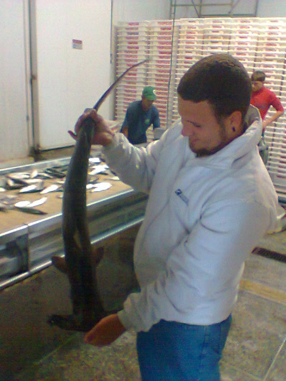

```{r setup, echo = FALSE}

# set working directory if has students directory and at R Console (vs knitting)
if ('students' %in% list.files() & interactive()){
    setwd('students' )
}

# ensure working directory is students
if (basename(getwd()) != 'students'){
  stop(sprintf("WHOAH! Your working directory is not in 'students'!\n   getwd(): %s", getwd()))
}

```


## *Content*
  
  I'm interested in fishery management and ocean conservation, particulary related to ecologically sensitive species such as **sharks and rays**.
  Currently I'm working in the [Fisheries Management](https://github.com/fishmgt) group for the Informatics course at the Master of Environmental Science and Management at UCSB.
  
  
        
## *Techniques*
        
  I hope to take from the Informatics course skills like how use the github plataform, that allows a collaborative workspace, and how to organize and manage data. Also, I think improving my R skills, especially in generating better visualitions of data, might be a differential in my future professional life.
        
## *Data*
        
  At the present moment I'm not participating in any MESM project. However, when searching for a opportunity to write my proposal I looked at The International Comission for the Conservation of Atlantic Tunas (ICCAT) database on shark captures, which I'll be using for this assignment.
  
  
```{r}

# read csv
d = read.csv('data/caio-faro_ICCATSharks.csv')
Brazil <- subset(d, PartyName == "BRAZIL")

summary(Brazil)

```


## *Data Wrangling*

```{r}

suppressWarnings(suppressMessages(require(readr)))
suppressWarnings(suppressMessages(require(dplyr)))

tbl_df(Brazil)

Brazil %>%
  select(ScieName, YearC, Status, Fleet, Stock, GearCode, Qty_t) %>%
  group_by(ScieName) %>%
  summarize(Total_Catch_t = sum(Qty_t))
  
```


## 4. Answers and Taks

_**Task**. Convert the following table [CO<sub>2</sub> emissions per country since 1970](http://edgar.jrc.ec.europa.eu/overview.php?v=CO2ts1990-2014&sort=des9) from wide to long format and output the first few rows into your Rmarkdown. I recommend consulting `?gather` and you should have 3 columns in your output._

```{r read co2, eval = FALSE}
library(dplyr)
library(readxl) # install.packages('readxl')

# xls downloaded from http://edgar.jrc.ec.europa.eu/news_docs/CO2_1970-2014_dataset_of_CO2_report_2015.xls
xls = '../data/co2_europa.xls'

require(tidyr)
require(dplyr)

print(getwd())
co2 <- read_excel(xls, skip=12)
Longco2 <- gather(co2, "Year", "Emissions", -Country) %>%
  mutate(Year = as.numeric(Year))

head(Longco2)
```


_**Question**. Why use `skip=12` argument in `read_excel()`?_
 Because the first 12 rows are metadata and we skip them to read only the data from the table we're gonna use.


_**Task**. Report the top 5 emitting countries (not World or EU28) for 2014 using your long format table. (You may need to convert your year column from factor to numeric, eg `mutate(year = as.numeric(as.character(year)))`. As with most analyses, there are multiple ways to do this. I used the following functions: `filter`, `arrange`, `desc`, `head`)_. 

```{r, eval = FALSE}

Top5 <- Longco2 %>%
    filter(Year == 2014, Country != "World", Country != "EU28") %>%
    arrange(desc(Emissions))

head(Top5, n=5)

```


_**Task**. Summarize the total emissions by country  (not World or EU28) across years from your long format table and return the top 5 emitting countries. (As with most analyses, there are multiple ways to do this. I used the following functions: `filter`, `arrange`, `desc`, `head`)_. 

```{r, eval = FALSE}

SumCountries <- Longco2 %>%
              filter(Country != "World", Country != "EU28") %>%
              group_by(Country) %>%
              summarise(TotalEmission = sum(Emissions)) %>%
              arrange(desc(TotalEmission))

head(SumCountries)


```


