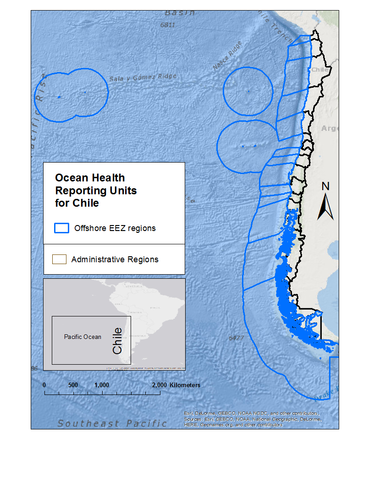

```{r}
# set working directory if has students directory and at R Console (vs knitting)
if ('students' %in% list.files() & interactive()){
    setwd('students' )
}

# ensure working directory is students
if (basename(getwd()) != 'students'){
  stop(sprintf("WHOAH! Your working directory is not in 'students'!\n   getwd(): %s", getwd()))
}
```


## Content

Text shows.

<!-- Text hidden with HTML. -->

```{r question, eval = FALSE, echo=FALSE}
Text hidden with R chunk, echo=F

What is your burning environmental question that you'd like to address? Feel free to provide group project, dissertation, and/or personal interest. What's the study area?
```

**_Is the health of the Chilean ocean changing regionaly?_**
  
  I would like to determine the health of the ocean's regions in Chile. By measuring ocean health across a portfolio of goals I can better understand potential trade-offs between goals and propose management targets for the future.
  

## Techniques

```{r question2, eval = FALSE, echo=FALSE}
 What techniques from the course do you think will be most applicable?

```        
 
Useful techniques will be:

* Tidying up Data
* Visualizing Data
* Interactive Plots and Maps
* Advanced Programming
  
        
## Data

```{r question3, eval = FALSE, echo=FALSE}
What data have you already identified? Feel free to provide a link and/or details on the variables of interest.

```        

I have have idenfied data of jobs, wages and revenues per region in Chile.
  
  The data will be used to calculate the Livelihoods and Economies goal in each region of Chile. This goal focuses on avoiding the loss of ocean-dependent livelihoods and productive coastal economies while maximizing livelihood quality. The Status of this goal is the average of the Status of the two sub-goals : livelihoods  (i.e., jobs and wages) and economies (i.e., revenues) using [data](http://www.ine.cl/canales/chile_estadistico/familias/laborales.php)
  


```{r data, echo=TRUE, eval=FALSE}
###Data File

#read csv
d=read.csv('data/faundez_Iregion.csv')

#output summary
summary(d)

```


## Reading and Wrangling Data
Where am I? Getting around in the Command Line
Knowing your present working directory is critical to using “relative” paths, ie relative to your present working directory. Relative paths (eg somedir/somefile.csv are often preferred over “absolute” paths (eg C:/somedir/somefile.csv) since the project’s root folder can move around on the machine or even to a different machine and still work, whereas an absolute path is locked down to a very exact machine-specific path. Here are a couple of aspects to keep in mind however when knitting Rmarkdown (*.Rmd) files:

When you open an RStudio project, the default present working directory is the top level folder for that project (and contains the *.Rproj file).

When you “Knit” an Rmarkdown file (*.Rmd), the working directory is set to the folder containing the *.Rmd and a new workspace is used.

The above differences mean that when writing chunks of R code, a path can work in the Console and fail when you go to “Knit” the Rmarkdown file (*.Rmd), or vice versa.

So let’s review some basic commands for navigating directories in both shell commands and R commands.

###Bash Shell
The bash shell is the most common Unix-based command shell, found in Linux and Mac machines. It gets emulated for Windows in the Git Bash Shell application when installing git. Natively, Windows uses the less powerful Windows DOS command prompt, which uses cd (for pwd and cd) and dir (instead of ls).

present working directory
pwd

change working directory
cd

list files
ls

list files that end in '.jpg'
ls *.jpg
Note the use of the wildcard * to indicate any set of characters.

###R
Now play with the same commands commented above, but in R.

```{r eval=FALSE}
# present working directory
getwd()

# change working directory
setwd('.')

# list files
list.files()

# list files that end in '.jpg'
list.files(pattern=glob2rx('*.jpg'))

# file exists
file.exists('test.png')
```

Look at the help for list.files() (?list.files or F1 with cursor over list.files() in editing window) to see that the pattern argument expects a regular expression and glob2rx() changes the wildcard or globbing pattern into a regular expression.

To work on your students/<user>.Rmd, I recomend you get the Console and your Rmarkdown file using the same working directory:

```
setwd('students')
```

#Install Packages
```{r eval=FALSE}
# list of packages
pkgs = c(
  'readr',        # read csv
  'readxl',       # read xls
  'dplyr',        # data frame manipulation
  'tidyr',        # data tidying
  'nycflights13', # test dataset of NYC flights for 2013
  'gapminder')    # test dataset of life expectancy and popultion

# install packages if not found
for (p in pkgs){
  if (!require(p, character.only=T)){
    install.packages(p)
  }
}
```

The gapminder dataset is “an excerpt of the data available at Gapminder.org. For each of 142 countries, the package provides values for life expectancy, GDP per capita, and population, every five years, from 1952 to 2007” (CRAN). Gapminder was the brain child of Hans Rosling who famously gave the TED Talk: The best stats you’ve ever seen - Hans Rosling.

#Readings
These are the main R packages we’ll be learning about this week:

readr: column types
dplyr: introduction
tidyr: tidy data
dplyr & tidyr: data wrangling cheatsheet
Reading CSV
utils::read.csv
Traditionally, you would read a CSV like so:
```{r eval=FALSE}
d = read.csv('../data/r-ecology/species.csv')
d
head(d)
summary(d)
```

#Multiple Variables
Now let’s approach this code sequentially using base functions, ie natively loaded functions in R without need for additional libraries.

```{r eval=FALSE}
# read in csv
surveys = read.csv("../data/r-ecology/surveys.csv") 

# view data
head(surveys)
summary(surveys)

# limit columns to species and year
surveys_2 = surveys[,c('species_id', 'year')]

# limit rows to just species "NL"
surveys_3 = surveys_2[surveys_2$species_id  == 'NL',]

# get count per year
surveys_4 = aggregate(species_id ~ year, data=surveys_3, FUN='length')

# write to csv
write.csv(surveys_4, "./data/surveys_faundez.csv", row.names = FALSE)

```

Because the variables are named sequentially, ie surveys_2 to surveys_4, it is relatively easy to follow, but so often in the course of playing with data these names are very different. And then we quickly lose track of which operations get applied to which variables.

Even with obvious variable names, there is a redunancy, as we’ll see shortly, to assigning a new variable name to the output of each operation and input of each subsequent operation.

Nested Functions
Another common programming trick to reduce variable naming space is to nest the output of one function as the input of the next one.

```{r eval=FALSE}
# read in data
surveys = read.csv("../data/r-ecology/surveys.csv") 

# view data
head(surveys)
summary(surveys)

# limit data with [], aggregate to count, write to csv
write.csv(
  aggregate(
    species_id ~ year, 
    data = surveys[surveys_2$species_id  == 'NL', c('species_id', 'year')], 
    FUN = 'length'), 
  "../data/surveys_faundez.csv",
  row.names = FALSE)
```

So the code started the same, and continues using the same functions, but these functions get applied from the input arguments to the outer containing functions, ie in a nested manner:

surveys gets sliced [] into rows and columns in one call, which gets used as the data = argument to

aggregate(), which applies the length() function to get a count to the formula species_id ~ year in which the species_id gets split into groups based on year, which gets further applied as the unnamed first argument to

write.csv() which has the additional unnamed argument specifying the output file and named argument turning off the default option to prefix row numbers.

Although we’ve saved space from not performing the extra naming of variables, we’ve made the code very difficult to read, needing to parse which functions are arguments to subsequent functions. The indentation helps readability a bit, but now let’s examine a far better solution to either approaches above with dplyr.

Elegance with dplyr
Next, we’ll use the libraries readrfor improved versions of reading and writing csv files, and dplyr for advanced data frame manipulation. Most importantly, dplyr uses the “then” operator %>% which transfers the output on the left to the first argument of the function on the right. Most simply surveys %>% summary() transfers the surveys data frame into the first argument of the summary function. Use of this chaining operator seems excessive in this simple example, but is powerful when chaining together many operations on the same data frame. We’re able to efficiently write out operations, get past the previous problem of multiple variable names without the obfuscation of nesting.

```{r eval=FALSE}
# load libraries
library(readr)
library(dplyr)

# read in csv
surveys = read_csv( "../data/r-ecology/surveys.csv") 

# dplyr elegance
surveys %T>%                          # note tee operator %T>% for glimpse
  glimpse() %>%                       # view data
  select(species_id, year) %>%        # limit columns
  filter(species_id  == 'NL') %>%     # limit rows
  group_by(year) %>%                  # get count by first grouping
  summarize(n = n()) %>%              #   then summarize
  write_csv('data/surveys_faundez.csv') # write out csv
```


Now we can read from the top, starting with the data frame surveys, to see a very clear sequence of operations:

glimpse()
select()
filter()
group_by()
summarize()
write_csv()

Arguments are minimal without repeating the name of the data frame, or even needing quotations in the case of column names.

The “tee” operator %T>% is similar to the “then” operator %>% in that the left side is passed to the right, but is then also teed off as the output of the right side. This is useful in this case for glimpse since its output is simply printed to the Console and does not otherwise return the data frame needed to continue the sequence of operations. So the “tee” operator %T>% is most useful for injecting intermediate operations like printing or plotting that wouldn’t otherwise output a return object for continuing operations.

# CO2 emissions assignment
## tidy 

Task. Convert the following table CO2 emissions per country since 1970 from wide to long format and output the first few rows into your Rmarkdown. I recommend consulting ?gather and you should have 3 columns in your output.

```{r}
library(dplyr)
library(readxl) # install.packages('readxl')

# xls downloaded from http://edgar.jrc.ec.europa.eu/news_docs/CO2_1970-2014_dataset_of_CO2_report_2015.xls
xls = '../data/co2_europa.xls'

print(getwd())
co2 = read_excel(xls, skip=12)
co2

```


### Question. Why use skip=12 argument in read_excel()?
skip = Number of rows to skip before reading any data. So it's 12 because data we want to use begin at row 13.

## tidyr

Two main functions: gather() and spread() 

```{r tidyr}
# install.packages("tidyr")
library(tidyr)
gather # gather to long
spread # spread to wide
```

### `gather`

```{r gather}
co2
d = gather(co2, "year", "n", -1)
d
# Other way to do the same: gather(co2, "year", "n", 2:ncol(co2)) or gather(co2, "year", "n", -Country)
```

Converting my year column from factor to numeric

```{r}
# install.packages("dplyr")
library(dplyr)

e = mutate(d, year = as.numeric(as.character(year)))
```


### summarize CO<sub>2</sub> emissions

_**Task**. Report the top 5 emitting countries (not World or EU28) for 2014 using your long format table. (You may need to convert your year column from factor to numeric, eg `mutate(year = as.numeric(as.character(year)))`. As with most analyses, there are multiple ways to do this. I used the following functions: `filter`, `arrange`, `desc`, `head`)_. 

_**Task**. Summarize the total emissions by country  (not World or EU28) across years from your long format table and return the top 5 emitting countries. (As with most analyses, there are multiple ways to do this. I used the following functions: `filter`, `arrange`, `desc`, `head`)_. 

```{r}
new2 = filter(e, year > 2013)   # other way is new <- e[e$year == 2014,]

new3 = arrange(new2, desc(n))

new4 = filter(new3, Country != c("World", "EU28"))

head(new4)

```


# dplyr

```{r eval=TRUE}
e %T>%                                           # note tee operator %T>% for glimpse
  glimpse() %>%                                  # view data
  filter(year > 2013) %>%                        # limit rows
  arrange(desc(n)) %>%                           # descendent order
  filter(Country != c("World", "EU28")) %>%      # limit rows
  write_csv('data/co2_faundez.csv')              # write out csv
  head(co2_faundez)
```


