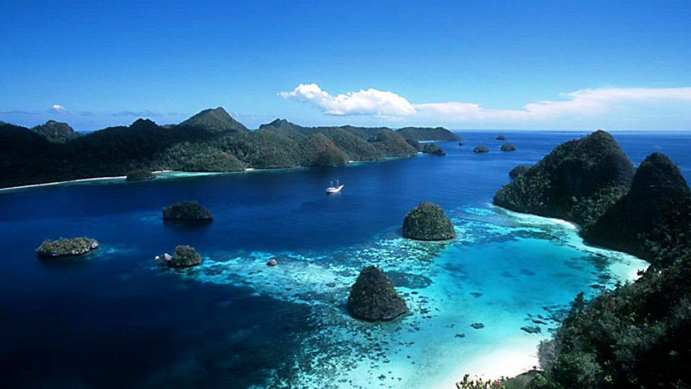

## Content
        
I work with the Fish Forever initiative  ([Fish Forever](http://www.fishforever.org)), a partnership between the Sustainable Fisheries Group at UCSB, Rare, and Environmental Defense Fund, aimed at improving management of small-scale fisheries in the developing tropics through the use of TURF-reserves.

  

One of the most critical challenges we face is assessing and managing fisheris in the data- and resource-limited situations where we work. To address this, we are using data-limited assessment techniques to creatively work with the data that we do have. However, no single technique is perfect, so we are therefore using multiple techniques to examine each fishery so that we can have a more complete understanding of how the fishery is performing. I therefore have two main research questions:

1. How can multiple data-limited assessment techniques, which might each give conflicting indications for how a fishery is doing, be interpreted and synthesized to make better management decisions for a fishery?  
2. How does including uncertainty, both in measurement error and life history information error, affect the interpretation and synthesis of multiple indicators?
        
## Techniques
        
To address this question, I will apply multiple data-limited assessment techniques to a single data set including:

* LBAR (for calculating fishing mortality)
* Catch Curve (for calculating fishing mortality)
* LBSPR (for calculating length-based spawning potential ratio)
* Froese sustainability indicators (for calculating percent mature, percent optimal, and percent megaspawner)
* Trends in Catch and CPUE
        
## Data
        
The data set I will be using is from Karimunjawa National Park, Indonesia. This site is a prototype site for the Fish Forever intervention. The data set runs from 2010-2014 and includes catch, effort, and length-composition data.

  