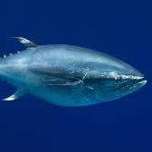

### Links to Personal Profiles
[**ResearchGate**](https://www.researchgate.net/profile/Juan_Villasenor-Derbez)   |
[**LikedIn**](https://www.linkedin.com/in/juan-carlos-villaseñor-derbez-48a807108)   |
[**Academia**](https://ucsb.academia.edu/JuanCarlosVillase%C3%B1orDerbez)   |
[**LAFF**](http://www.laff.bren.ucsb.edu/laff-network/juan-carlos-villase%C3%B1or)

## Our organization:

###[**fish-ecol**](https://github.com/fish-ecol)



## Content

The relationships between modern human society and the environment are rapidly becoming important factors that must be understood in order to correctly manage our resources. I look forward to perform research that broadens my knowledge of fish ecology, fisheries management, and human interactions with the environment, as well as environmental policy.

My latest works include exploring the effects of [Marine Reserves on Grouper populations](http://bit.ly/20rlRQc), a biogeographic analysis of the [nearshore fishes of the Cedros Archipelago](https://www.researchgate.net/publication/285252340_The_nearshore_fishes_of_the_Cedros_Archipelago_North-Eastern_Pacific_and_their_biogeographic_affinities), and the effects of [human population on fish size structure](https://www.researchgate.net/publication/273576516_EL_TAMANO_IMPORTA_EN_LOS_PECES_CAMBIOS_LATITUDINALES_EN_LAS_ESTRUCTURAS_DE_TALLAS_DE_SEIS_ESPECIES_DE_PECES_ASOCIADOS_A_LOS_BOSQUES_SUBMARINOS_DE_LA_COSTA_OCCIDENTAL_DE_BAJA_CALIFORNIA_MEXICO). For my Group Project at Bren, we will perform an evaluation of the Marine Reserves implemented by [COBI](www.cobi.org.mx) -Mexican NGO.

Now, I have taken a step further and moved into the realm of ecological modeling. I am modifying the Biological Value Index proposed by Sanders (1960) and modified by Loya-Salinas & Escofet (1990). I am also in the first stages of exploring patterns in the biomass of the California Sheephead (*Semmicosyphus pulcher*). Furthermore, I want to evaluate the seasonality of Kelp forests (*Macrocystis pyrifera*) along the Baja California Peninsula to identify perenneal forests and link this to the fishing yields of nearby communities.


        
## Techniques

Since my first project ([lionfish feeding ecology](https://www.researchgate.net/publication/265293117_Brief_description_of_prey_selectivity_and_ontogenetic_changes_in_the_diet_of_the_invasive_lionfish_Pterois_volitans_Actinopterygii_Scorpaenidae_in_the_Mexican_Caribbean)), I recognized the importance of database management and colaboration. From what we've seen, I think Git and GitHub are one of the most valuable techniques that I may harvest from the course. Along the line, **BIG DATA** management is also something I'd like to explore.


## Data

We have not defined a single project idea or question, but my colaborators [Juan Mayorga](http://ucsb-bren.github.io/env-info/students/juanmayorgahenao.html) and [Niko H.](http://ucsb-bren.github.io/env-info/students/zebos1.html) have extensive knowledge in programing, marine ecology, and database management. We have identified some datasets which we'd like to submit to interogation and obtain as many answers as possible. *Further to come next week, when we narrow it down.*

## Some examples

```{r}
# Read some data
SemPul=read.csv("data/jcvdav_SemPul.csv", sep=";")
# Data has been modified from the original, which is confidential

# Now a summary
summary(SemPul)
```


```{r echo=FALSE}
# I extract the database to have two subsets according to fishing pressure
SemPulH=subset(SemPul, Fishing.Pressure=="High")
SemPulL=subset(SemPul, Fishing.Pressure=="Low")

# And plot the histograms for each of them
hist(SemPulH$Lt..cm., main="Size structure under high fishing pressure", xlab="Total length(cm)", col="red")
hist(SemPulL$Lt..cm., main="Size structure under low fishing pressure", xlab="Total length(cm)", col="blue")

```

