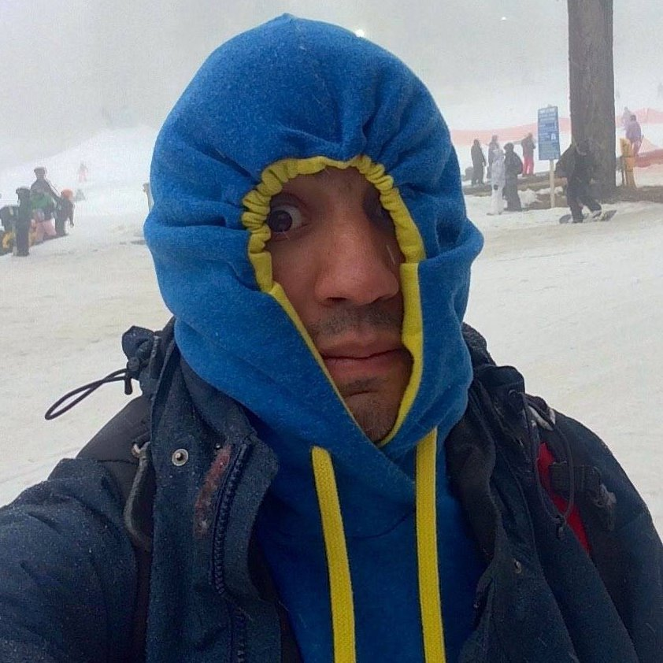

### Content

I am interested in human driven impacts (with special attention to climate change) on fisheries resources in Latin America. How impacts of environmental change affect social structures, such as food security and local economies, how they can be measured, and how to create social adaptive capacity to such changes. 

As of today, I'm on my second year of the Master program at the Bren School of Environmental Science & MAnagement. My group proyect looks to develop a Citizen Science program for the rocky intertidal zone

More about our project in:
http://intertidalteam.weebly.com

### Techniques

I think that GitHub will be a great tool for mi present and future work. At Bren, I've been envolved to coding projects. Learning how to use GitHub will provide me a new tool to organize my group-work.

### Data

I still have no data for my proyect. I Could use some of the FAOStats available data. I would like to address climate change impacts to a certain species or may be a group of.

``` {r}
suppressWarnings(library(readr))
suppressWarnings(library(knitr))

 # read csv
Data = read.csv("data/jepa_ReefPerch.csv")
  
# output summary
summary(Data)
```

```{r Plot Example}
plot(Data)
```

## Asignment Reading and Wrangling
### EDAWR

```{r EDAWR}
suppressWarnings(library(EDAWR))
kable(storms)
kable(cases)
kable(pollution)

ratio <- storms$pressure/storms$wind
```

### Tidyr

```{r tidyr}
suppressWarnings(library(tidyr))
?gather
?spread

k<- gather(cases,"year","n",2:4)
kable(k)
PollutionTable <- spread(pollution,"size","amount")
kable(PollutionTable)
SepStorms<- separate(storms, date, c("year", "month", "day"), sep = "-")
kable(SepStorms)
UniteStorms <- unite(SepStorms, "date", year, month, day, sep = "-")
kable(UniteStorms)
```

### Dplyr

```{r dplyr} 
suppressWarnings(library(dplyr))
suppressWarnings(library(nycflights13))

StormPressure<- select(storms, storm,pressure) #selects from "storms" data "storm and pressure"
select(storms,-storm) #sellects all except "storm"
Avion<- select(planes,type:model)
kable(head(Avion))

filter(Avion,manufacturer == "EMBRAER")
filter(planes, manufacturer == "EMBRAER", model %in% c("EMB-145XR","EMB-145LR"))
Planes2 <- select(planes,manufacturer,engines,seats)
PlanesMut<- mutate(Planes2, PPlPerSeat = seats/engines)
kable(head(PlanesMut))

planes %>% summarise(median = median(seats), variance = var(seats),mean=mean(seats),sd=sd(seats),n=n())
arrange(storms,wind)

```

#### The Pipe Operator 
```{r The Pipe}
select(airports, name,alt)
airports %>% select(name,alt)
A<- airports %>% filter(alt >= 2000)
kable(head(A))
```

###Unit of Analysis

```{r Unit of Analysis}

pollution %>% group_by(city) %>% summarise(mean = mean(amount), sum = sum(amount), n = n())

planes %>% group_by(manufacturer) %>% summarise(mean=mean(seats),sd=sd(seats),n=n())
```

### Joining Data

```{r Joining Data}
Colors<-bind_cols(y,z)
kable(Colors)
kable(Colors)
Cr<- bind_rows(y, z)  
kable(Cr)
Un<-union(y, z)
kable(Un)
In<-intersect(y, z)
kable(In)
Set<-setdiff(y, z)
kable(Set)

AName <- left_join(songs, artists, by = "name")
kable(AName)
LFL<- left_join(songs2, artists2, by = c("first", "last"))
kable(LFL)
InnerN<- inner_join(songs, artists, by = "name")
kable(InnerN)
SemNa<- semi_join(songs, artists, by = "name")
kable(SemNa)
AJ<-anti_join(songs, artists, by = "name")
kable(AJ)
```
