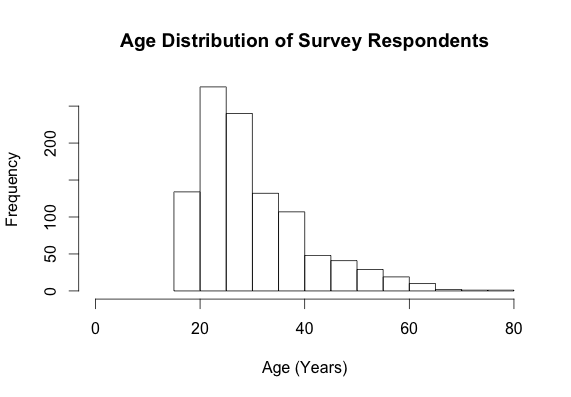

## Content
        
For this class, the group will be working to create a program to take in survey data in real time, reorganize it, and output summary statistics. For my group project (on Santa Barbara water supply) and future work, I'm most interested in learning data management strategies and ways to visualize data. 
        
## Techniques
        
1. Wrangling data
2. Cleaning up data
3. Visualizing data
    + **interactive maps**
    + *interactive time series*
        
## Data
        
A group member has data on survey responses on solid waste. Data is received via text message and associated timestamps. The responses need to be tied to a specific survey question and organized.
  
## Image


<!--- hist(ugandasms$age, main="Age Distribution of Survey Respondents", xlab="Age (Years)", xlim=c(0, 80))-->

Fig. 1. Histogram of age distribution of survey respondents.

## Summary of Survey Response Data
```{r}
# read csv
d = read.csv('data/jkidson_ugandasms.csv')
      
# output summary
summary(d)
```

### [Citizen Monitoring Github Page](https://github.com/citizen-monitoring)
