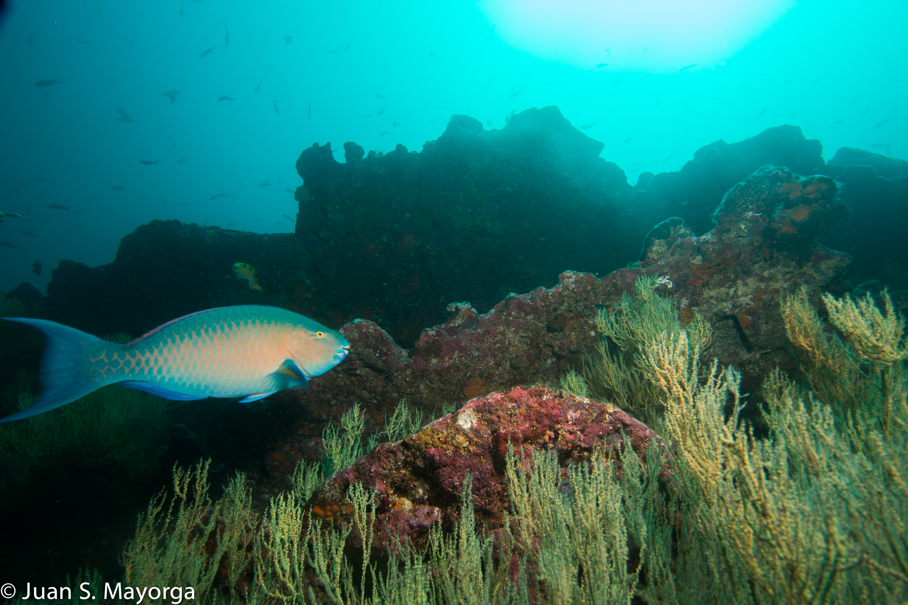

## Content

I'm very interested in investigating how can *dynamic* **ecosystem-based management** strategies be designed to protect and recover marine resources. In particular, I'm interested in reef-associated predators and their role in ecosystem stability and resilience. Some burning questions are: 

- What can we learn from studying the populations of reef-associated predators that can inform the design and implementation of dynamic ecosytem-based management ? 
- How can *dynamic* ecosystem-based management increase resource stewardship of coastal communities?

I'm also passionate about ocean exploration, science communication, and outreach. I sail with the Ocean Exploration Trust doing deep sea reseach onboard the *E/V Nautilus*. Follow our research at:  <http://www.nautiluslive.org>



## Techniques

I believe that having a streamlined, transparent, and reproducible approach to managing data and conducting scientific analysis is of paramount importance to do **interdisciplinary** and **collaborative** work. I'm looking forward to deepening my R skills, to become confortable with GitHub, and to expand my skills in visualization and communication of results. 

## Data

Currently, I don't have data related to the specific research question stated above. The data that I'll use in this assignment pertains to a long term ecological assessment of reef fish populations in the lagoons of Rarotonga and Aitutaki for the years 2002 and 2014. This data has been provided by profesor Hunter Lenihan for his course on Applied Marine Ecology. 

```{r}
# read csv
d = read.csv('data/juanmayorgahenao_hunterdata.csv')
surgeon <- subset(d, Species == "Surgeonfish")
trout <- subset(d, Species == "Coral Trout")
spotted <- subset(d, Species == "Spotted Damselfish")
yellow <- subset(d, Species == "Yellow Damselfish")
densities <- data.frame(surgeon$Adults, trout$Adults, spotted$Adults, yellow$Adults)
colnames(densities) <- c("Surgeon", "Coral Trout", "Spotted Damselfish", "Yellow Damselfish")
# output summary
summary(densities)
```
