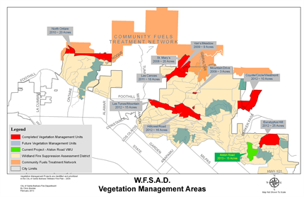

## Content
  
  Our [group project](http://sbfire.weebly.com/) is an *assessment* of the benefits of fire mitigation programs cities in the **wildland urban interface**, using Santa Barbara as a case study. We have already distributed a survey to the residents of the City of Santa Barbara's Wildland Fire Suppression Assessment District in order to gauge the attitudes of the residents toward the program. We have also ran fire modeling programs to determine the effectiveness of the vegetation treatments of the program. The final component of our project will be looking at the transferability of the program, and we are trying to determine what other cities in California may benefit from a similar program. 
  
  The picture below shows the extent of the Wildland Fire Suppression Assessment District in the City of Santa Barbara.
  
  
        
## Techniques
        
  We plan on using AHP to determine the weights that should be given to the variables we have deemed as most important for the transferability of this program. My group chose 5 variables of interest, and we will be giving fire experts the AHP survey to give us their opinion on their relative importances. Learning to be more fluent with writing code for models will help us turn the AHP information into a GIS model that picks cities with similar traits to Santa Barbara. I look forward to learning how to make an interactive map that can clearly and concisely explain our findings.
  
  * Variables of Interest
    + Fire Frequency
    + WUI Index
    + Vegetation Type
    + Topography
    + Demographics
        
## Data
  
  We have found GIS data layers and historic fire data from CalFire for       the 5 variables of interest with which we will create the model to narrow down to the cities that could benefit from a similar program.
  
```{r}
# read csv
d = read.csv('data/julimatos_FullData.csv')
      
# output summary
summary(d)
```

[My Organization](http://fire-mitigation.github.io/)