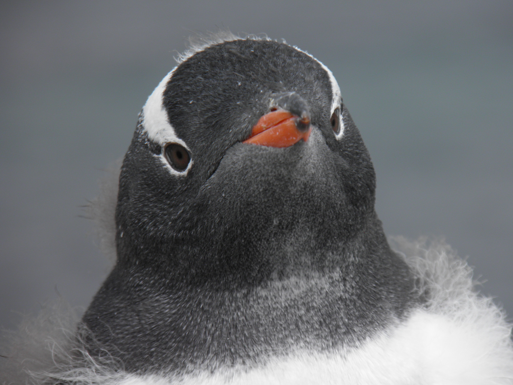

## Content
        
I am interested on climate impacts on a large landscape scale, how ecosystems and species will adapt, and how we as managers can help improve the resilience of these environments. 
        
## Techniques

There are several techniques I am looking forward to learning:

1. Dealing with large datasets
2. Using Git to collaborate with other researchers
3. Visualizing and sharing data analytics
        
## Data
        
I did make up some data today during class:
  
```{r echo= FALSE}
impacts<- c(1,1,3, 3,4,5,6, 6, 6, 7)
temp<- c(20,22, 24, 25.5,28, 28, 32, 31, 29, 32)

sea_data<-data.frame(impacts, temp)
colnames(sea_data)<- c("sea_rise", "ave_temp")

model<-lm(sea_rise~ ave_temp, data=sea_data)
plot(sea_data$ave_temp, sea_data$sea_rise, ylab = "Sea Level Rise (m)", xlab="Temp (C)", main="Invented Sea Level Rise with Rising Temperatures")
abline(model, col="red")
```

I do think United National Environmental Programme will have some interesting data, as will NOAA.  
 
## Penguins
Here is a photo of a molting, juvenile Gentoo penguin (*Pygoscelis papua*) on [King George Island](https://www.google.com/maps/place/King+George+Island,+Antarctica/@-62.0757944,-58.8658154,9z/data=!3m1!4b1!4m2!3m1!1s0xbc738f0fdffd7975:0x759c74bafe566d71), Antarctica. I took this photo in February, 2011 while working for NOAA. 



##Sea Level Rise Data from UNEP

I downloaded data from the United National Environmental Programme's [Environmental Data Explorer](http://ede.grid.unep.ch/) that contains the percent of total land area that is below 5m elevation for each country. Below are summary statistics of that data:

```{r}
# read csv
sea_level_unep_kb <- read.csv("data/knboysen_sea_level_unep.csv")
      
# output histogram
hist(sea_level_unep_kb$Percent_land_under_5m, xlab="Percent Land Below 5m", main="Histogram of UNEP Elevation Data", col ="blue")
```

This data set includes `r nrow(sea_level_unep_kb)` countries. Below is a table of the `r nrow(subset)` countries that are completely (100% of land area) below 5m of elevation
```{r}
subset<- subset(sea_level_unep_kb, Percent_land_under_5m==100)
print(subset[,c(1,3,15)])
```

The mean percent of land under 5m is `r mean(na.omit(sea_level_unep_kb$Percent_land_under_5m))`%. 


