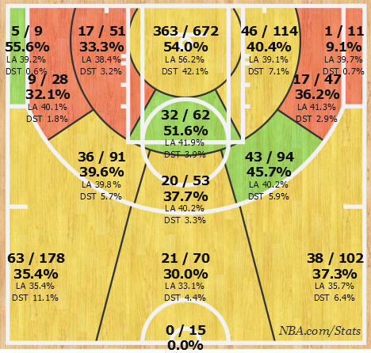
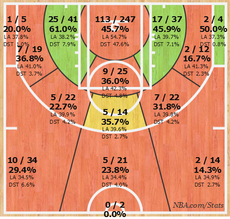

  ## **Content**
        
I am interested in reducing waste and inefficient products that create environmental and toxilogical harm. I am also interested in GIS and visualizing geographic data in useful and interesting ways (*especially data related to global deforestation right now as it is a large component of my thesis project*)

In this class I will be looking into pollution statistics... [see my group site here](https://github.com/pollute/pollute.github.io)


  ## **Techniques**
        
I think collaborative model building and interactive plots and maps will be very useful for my project now and research in the future.        

  ## **Data**
        
  For now, in the name of practice, I'll illustrate some data on how far Derrick Rose, point gaurd for the Chicago Bulls who has been horrendously riddled by knee injuries, has fallen statistically from his great 2010-2011 campaign.
  
  
  
  
  Here is his shot chart from 2010-2011
  
  
  
  
  Here is his shot chart so far from 2015-2016
  
  
  
  
  As can be seen, Derrick Rose's overall shooting efficiency has plummeted... This decline can aslo be seen in his overall [stats](http://stats.nba.com/player/#!/201565/)... The future looks tragically quite dim for the former MVP.
  
```{r, echo=FALSE, warning=FALSE}
# read csv
d = read.csv(file='data/maierucsb_DRose.csv')
      
# output barplot
barplot(as.matrix(d[2:16]),cex.names=0.5, xlab="Statistical Category",ylab="Per Game Averages",legend=d$Year)

```
  