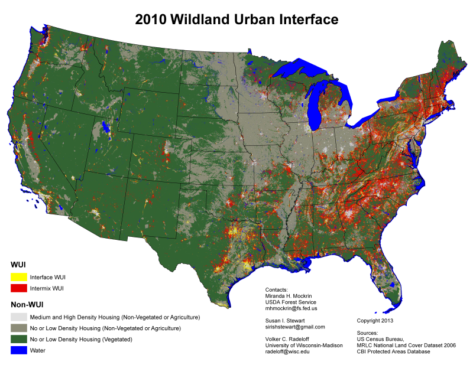

####Organization
[fire-mitigation](https://github.com/fire-mitigation)

### Content

```      
What is your burning environmental question that you would like to address? Feel free to provide group project, dissertation, and/or personal interest. What is the study area?
```


I would like to determine what California cities are most like Santa Barbara in regards to wildfire potential. I would like to create a weighted model, from expert opinion, to select cities based on the weighted factors. 

### Techniques
        
```
What techniques from the course do you think will be most applicable?
```

  I think the lessons on interactive plots and maps will be most useful to my specific question. I also believe, that the wrangling data and visualizing data lessons will be useful overall to my future career. 
        
### Data
        
```
What data have you already identified? Feel free to provide a link and/or details on the variables of interest.
```

  
  The data that we will use for our weighted model will come from two sources. One will be the various data layers that we have for GIS (e.g. vegetation, wildland urban interface, census, fire history, and jurisdictional layers). Our second data source will be a collective weight that is assigned to each of those variables based on the expert opinion. We are collecting that information on Thursday, January 21st from members of the Santa Barbara Fire Safe Council using the [analytical hierarchy process](https://en.wikipedia.org/wiki/Analytic_hierarchy_process).


####Our Process

1. Collect expert opinion on weighted factors using AHP survey
2. Collect and organize necessary map layers    
    + Get GIS layers
    + Clean them up and organize attribute table to show only the data that is needed
3. Combine the weighted factors and the layers in a GIS model to select the appropriate cities

  
###Image

```
2010 WUI Map
```
A map of the _most recent_ comprehensive calculation of total wildland urban intermix in the US is shown below. The map was created by the __US Forest Service__.



###Data File
```{r}
#read csv
d=read.csv('data/smccutcheon_FullData.csv')

#output summary
summary(d)
```