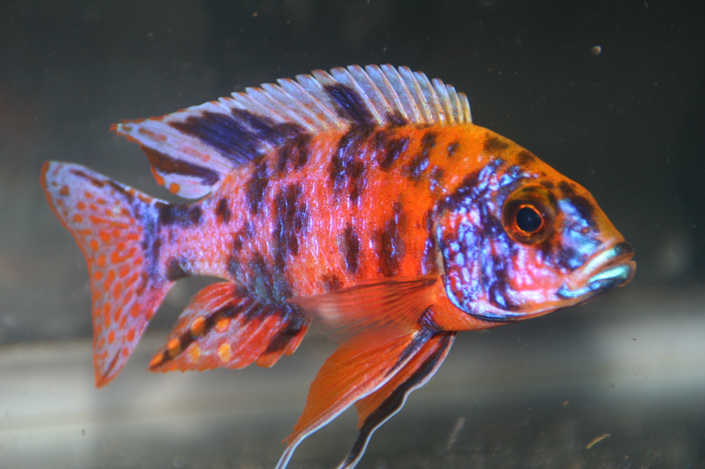

**Author: Niko Hartline**

*Acknowledgements: BBest for the great .Rmd guide*

  

  ## Content

  I'd love to examine the locations of endangered species of fish as listed by the IUCN Red List. In freshwater systems it would be interesting to find how nitrogen use may affect endangerment status.
  
1. Freshwater Fish
    + Nitrogen Use Effect
2. Brackish Fish
3. Ocean Fish
        
  ## Techniques
        
 Since the data will be coming from different source (the IUCN Red List and FAOSTAT), effective data concatenation will be key
        
  ## Data
        
  [IUCN Red List](http://www.iucnredlist.org/) and [FAOSTAT](http://faostat.fao.org/) will be the two primary data sources for this endeavor. 
  
```{r}

Singleton_Country_Aggregates = read.csv('./data/zebos1_Singleton_Country_Aggregates.csv')

summary(Singleton_Country_Aggregates)
```
  
  ## Data Wrangling
  
  ##The .. tells R to back up one directory! Extremely useful! . Uses the current folder (I'd assume ... backs out two directory folders)

```{r,eval=FALSE}
# Run this chunk only once in your Console
# Do not evaluate when knitting Rmarkdown

# list of packages
pkgs = c(
  'readr',        # read csv
  'readxl',       # read xls
  'dplyr',        # data frame manipulation
  'tidyr',        # data tidying
  'nycflights13', # test dataset of NYC flights for 2013
  'gapminder')    # test dataset of life expectancy and popultion

# install packages if not found
for (p in pkgs){
  if (!require(p, character.only=T)){
    install.packages(p)
  }
}
```

readr with read_csv is different from read.csv and shows the class of variables. If you see this Ben/Naomi, what are some other differences between the two functions?

```{r}
library(readr)
library(dplyr)

read_csv('../data/r-ecology/surveys.csv') %>%
  select(species_id,year)%>%
  #filter(species_id=='NL')%>%
  group_by(species_id,year)%>%
  count(species_id,year)%>%
  head()

```


