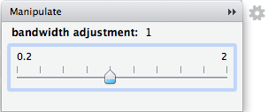

```{r setup, include=FALSE}
knitr::opts_chunk$set(echo = FALSE)
library(dplyr)
```

# overview {.smaller}

live: <https://bdbest.shinyapps.io/shiny_demo>

source: <https://github.com/ucsb-bren/env-info/tree/gh-pages/wk08_shiny/shiny_demo.Rmd>

## learning objectives

- understand concepts of shiny:
    - user interface (sliders, drop down menus, buttons, ...)
    - server functions (visualizations, tables, ...)
    - reactivity
- create shiny apps responsive to user input
- share apps online via github or shinyapps.io

## outline

- interactive with `ggvis`
- demo shiny in rmarkdown
- demo shiny as standalone
- shiny background
- sharing shiny app:
    - as website: <http://shinyapps.io>
    - as R command: `shiny::runGitHub()`

# interactive, beyond console

picking up from week 6: interactive plotting

## interactive packages, at console

package      | graphics                              | click/hover                | Console                    | Shiny
-------------|---------------------------------------|----------------------------|----------------------------|------
`manipulate` | `r icon('check-square-o')`        any | `r icon('square-o')`       | `r icon('check-square-o')` | `r icon('square-o')`
`ggvis`      | `r icon('check-square-o')` ggvis only | `r icon('check-square-o')` | `r icon('check-square-o')` | `r icon('check-square-o')`

- The `manipulate` package has the flexibility of using any graphics package, but `ggvis` can also be rendered in Shiny and enable interactivity within the plot like click and hover events.

- Let's first see `ggvis` within this Shiny Presentation, then we'll look at how else Shiny can be rendered.

## `manipulate`

We can use the `manipulate` function to provide interactive sliders, checkboxes and pickers. It only works within RStudio Console and does not work in a knitting context, nor Shiny.

```{r, eval=F, echo=T}
library(manipulate)
manipulate({
  faithful %>%
    ggplot(aes(eruptions)) + 
    geom_histogram(aes(y = ..density..),  bins = 20) +
    geom_density(color='blue', size=2, adjust=a)
}, a = slider(
  min = 0, max = 2, initial = 1, 
  label = 'bandwidth adjustment', step = 0.2))
```



## `ggvis::input_slider()` rendered

```{r}
library(ggvis) # install.packages('ggvis')

faithful %>%
  ggvis(~eruptions) %>%
  layer_histograms(
    width = input_slider(0.1, 2, step = 0.2, label = 'bin width'),
    fill = 'blue') %>%
  add_axis('x', title = 'duration (minutes)') %>%
  add_axis('y', title = 'count')
```

## `ggvis::input_slider()` code

```{r, eval=F, echo=T}
library(ggvis)

faithful %>%
  ggvis(~eruptions) %>%
  layer_histograms(
    width = input_slider(0.1, 2, step = 0.2, label = 'bin width'),
    fill = 'blue') %>%
  add_axis('x', title = 'duration (minutes)') %>%
  add_axis('y', title = 'count')
```

## `ggvis::add_tooltip()` rendered

```{r}
cars = mtcars %>%
  add_rownames('model') %>% # dplyr drops rownames
  mutate(id = row_number()) # add an id column to use as the key

all_values <- function(x) {
  if(is.null(x)) return(NULL)
  row <- cars[cars$id == x$id, ]
  paste0("<strong>", names(row), "</strong>: ", format(row), collapse = "<br/>")
}

cars %>% 
  ggvis(x = ~wt, y = ~mpg, key := ~id) %>%
  layer_points() %>%
  add_tooltip(all_values, 'hover')
```

## `ggvis::add_tooltip()` code

```{r, eval=F, echo=T}
cars = mtcars %>%
  add_rownames('model') %>%        # dplyr drops rownames
  mutate(id = row_number()) # add an id column to use ask the key

all_values <- function(x) {
  if(is.null(x)) return(NULL)
  row <- cars[cars$id == x$id, ]
  paste0("<strong>", names(row), "</strong>: ", format(row), collapse = "<br/>")
}

cars %>% 
  ggvis(x = ~wt, y = ~mpg, key := ~id) %>%
  layer_points() %>%
  add_tooltip(all_values, 'hover')
```

# shiny in rmarkdown

## shiny in rmarkdown

Previous `ggvis` slides rendered within a Shiny Presentation via RStudio menu, File > New File > R Markdown...

`r img(src='./img/rstudio_file-new-rmarkdown-shiny.png', height=450)`

## shiny in rmarkdown: front matter

This simply adds `runtime: shiny` to the front matter of an `html_document` or `ioslides_presentation`.

- Shiny Document:

    ```yaml
    ---
    output: html_document
    runtime: shiny
    ---
    ```

- Shiny Presentation:

    ```yaml
    ---
    output: ioslides_presentation
    runtime: shiny
    ---
    ```

# standalone shiny

## old faithful shiny app

```{r}
ui = shinyUI(bootstrapPage(

  selectInput(inputId = "n_breaks",
      label = "Number of bins in histogram (approximate):",
      choices = c(10, 20, 35, 50),
      selected = 20),

  checkboxInput(inputId = "individual_obs",
      label = strong("Show individual observations"),
      value = FALSE),

  checkboxInput(inputId = "density",
      label = strong("Show density estimate"),
      value = FALSE),

  plotOutput(outputId = "main_plot", height = "300px"),

  # Display this only if the density is shown
  conditionalPanel(condition = "input.density == true",
    sliderInput(inputId = "bw_adjust",
        label = "Bandwidth adjustment:",
        min = 0.2, max = 2, value = 1, step = 0.2)
  )

))

server = shinyServer(function(input, output) {

  output$main_plot <- renderPlot({

    hist(faithful$eruptions,
      probability = TRUE,
      breaks = as.numeric(input$n_breaks),
      xlab = "Duration (minutes)",
      main = "Geyser eruption duration")

    if (input$individual_obs) {
      rug(faithful$eruptions)
    }

    if (input$density) {
      dens <- density(faithful$eruptions,
          adjust = input$bw_adjust)
      lines(dens, col = "blue")
    }

  })
})

shinyApp(ui, server)
```

<http://shiny.rstudio.com>

## shiny components

Here's the simplest possible shiny app:

```{r, eval=F, echo=T}
library(shiny)
ui = fluidPage()
server = function(input, output) {}
shinyApp(ui, server)
```

- `ui`: user interface

- `server`: functions handling input and output

- `shinyApp`: runs the components

## old faithful ui {.smaller}

```{r, eval=F, echo=T}
ui = shinyUI(bootstrapPage(

  selectInput(inputId = "n_breaks",
      label = "Number of bins in histogram (approximate):",
      choices = c(10, 20, 35, 50),
      selected = 20),

  checkboxInput(inputId = "individual_obs",
      label = strong("Show individual observations"),
      value = FALSE),

  checkboxInput(inputId = "density",
      label = strong("Show density estimate"),
      value = FALSE),

  plotOutput(outputId = "main_plot", height = "300px"),

  # Display this only if the density is shown
  conditionalPanel(condition = "input.density == true",
    sliderInput(inputId = "bw_adjust",
        label = "Bandwidth adjustment:",
        min = 0.2, max = 2, value = 1, step = 0.2)
  )

))
```

## old faithful server {.smaller}

```{r, eval=F, echo=T}
server = shinyServer(function(input, output) {

  output$main_plot <- renderPlot({

    hist(faithful$eruptions,
      probability = TRUE,
      breaks = as.numeric(input$n_breaks),
      xlab = "Duration (minutes)",
      main = "Geyser eruption duration")

    if (input$individual_obs) {
      rug(faithful$eruptions)
    }

    if (input$density) {
      dens <- density(faithful$eruptions,
          adjust = input$bw_adjust)
      lines(dens, col = "blue")
    }

  })
})
```

## old faithful `shinyApp()`

```{r, eval=F, echo=T}
shinyApp(ui, server)
```

- Embedded `ui`, `server` and `shinyApp` above into single chunk to render in presentation.

## new shiny web app

In RStudio menu, File > New File > Shiny Web App...

    `r img(src='./img/new-shiny-app_myfirstapp.png', height=200)`

Files created within a dedicated directory, depending on configuration:

1. single `app.R`, launches with `shinyApp(ui = ui, server = server)` in source

1. multiple `ui.R` and `server.R`, launches with `shiny::runApp('dir')` from Console

## shiny cheat sheet

The cheat sheets is very helpful

- [shiny-cheatsheet.pdf](../refs/cheatsheets/shiny-cheatsheet.pdf)

    `r img(src='./img/shiny_summary.png', height=250)`

# shiny essentials

## shiny architecture: local

Every Shiny app is maintained by a computer running R

`r img(src='./img/shiny-arch_1-laptop.png', width=1000)`

which can be your local laptop...

source: <http://bit.ly/shiny-quickstart-1>

## shiny architecture: server

... or a server on the web.

`r img(src='./img/shiny-arch_2-server.png', width=1000)`

source: <http://bit.ly/shiny-quickstart-1>

## shiny architecture: components

Either way, the user interface is rendered to a web browser. Elements of the user interface are populated by functions executed in R.

`r img(src='./img/shiny-arch_3-components.png', height=450)`

source: <http://bit.ly/shiny-quickstart-1>


